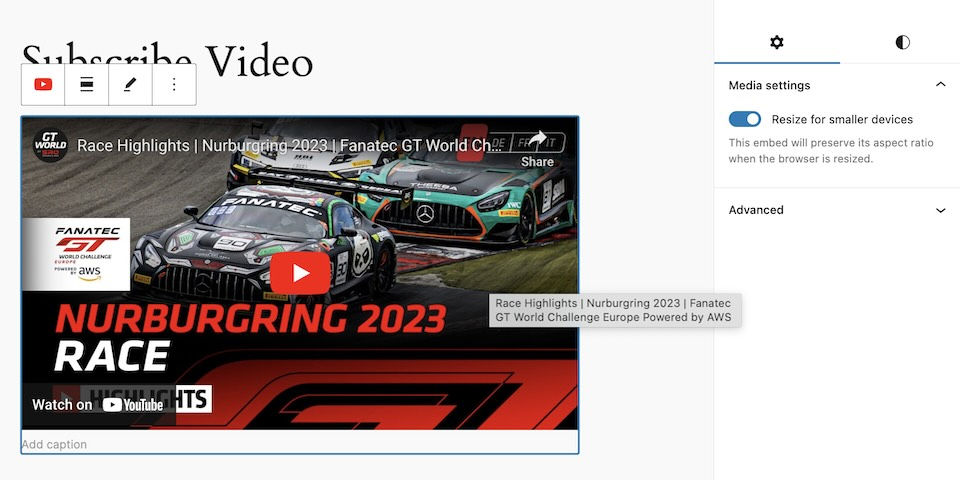
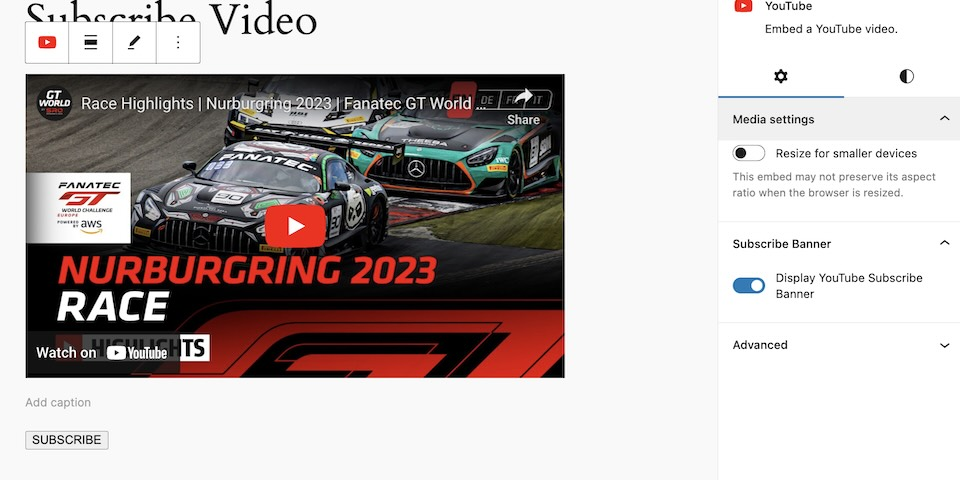

Manipulating existing blocks can be a bit tricky because it involves modifying multiple areas for everything to work. For example, let's say we want to add a subscribe banner to the YouTube embed block. To best walk through this, let's break it down into main steps:

1. We need controls to enable or disable the subscribe banner within the block editor.
2. We need a value that indicates when the banner is enabled or disabled.
3. We need to display the subscribe banner on the frontend.

**Before getting started, you'll need to create a `filters.js` within your plugin. This file must be loaded within the block editor.**

## Inserting a new block attribute on an existing block

The first step to setting this up is to add a new block attribute that we can use to enable/disable our settings.

1. First, we're checking for the block we wish to target, e.g., `core/embed`, and ignoring all other blocks.
2. Next, we're returning a new Object with our settings cloned over using the JS spread operator, with our newly inserted block attribute `enableSubscribeBanner`.
3. Lastly, we're using `blocks.registerBlockType` to return the new settings object with our attribute.

*Note: I recommend setting this control to `false` to not impact existing blocks on a site.*

```js
import { addFilter } from '@wordpress/hooks';
import { PanelBody, ToggleControl } from '@wordpress/components';

/**
 * Insert new enableSubscribeBanner boolean attribute to the core/embed block.
 *
 * @param {Object} settings Block settings object.
 * @param {string} name registered block name.
 * @returns {Object} Updated settings.
 */
function insertEmbedEditorControls( settings, name ) {
	if ( 'core/embed' !== name ) {
		return settings;
	}

	// Return updated settings.
	return {
		...settings,
		attributes: {
			...settings.attributes,
			enableSubscribeBanner: {
				type: 'boolean',
				default: false,
			},
		},
	};
}

addFilter(
	'blocks.registerBlockType',
	'mle-block-library/embed-subscribe-button',
	insertEmbedEditorControls
);
```

## Modifying the Edit function of an existing block

Once we have a block attribute, we're ready to modify the edit render of the `core/embed` block. The code below inserts two key parts: the toggle control inspector panel and the subscribe banner markup using a Higher Order Component (HoC).

Quick sidebar on the HoC and why it's necessary: A great way to think about a Higher Order Component is that you're borrowing another component and adding something to it. In this case, we're borrowing the `BlockEdit` component of the `core/embed` block and then returning additional features alongside it.

In the code below, we're doing the following:

1. Taking our `BlockEdit` of the `core/embed` block and wrapping it in a HigherOrderComponent using `createHigherOrderComponent`.
2. We're wrapping the original block with a new `div` wrapper and inserting our subscribe banner to be displayed in the editor.
3. We're inserting a toggle control that can toggle the `enableSubscribeBanner` value.
4. Lastly, we're using `blocks.BlockEdit` to register the new `BlockEdit` with our features.

```js
import { __ } from '@wordpress/i18n';
import { createHigherOrderComponent } from '@wordpress/compose';
import { InspectorControls } from '@wordpress/block-editor';
import { PanelBody, ToggleControl } from '@wordpress/components';

/**
 * Insert new subscribe banner markup and controls on the core/embed editor function.
 *
 * @returns BlockEdit with subscribe banner functionality.
 */
const withSubscribeBanner = createHigherOrderComponent( ( BlockEdit ) => {
	return ( props ) => {
		if (props.name !== 'core/embed') {
			return <BlockEdit { ...props } />;
		}

		const hasSubscribeButton = props.attributes.enableSubscribeBanner

		return (
			<>
				<div className="embed-subscribe-wrapper">
					<BlockEdit { ...props } />
					{ hasSubscribeButton &&
						<div className="embed-subscribe-banner">
							<button>SUBSCRIBE</button>
						</div>
					}
				</div>
				<InspectorControls>
					<PanelBody title={ __( 'Subscribe Banner' ) }>
						<ToggleControl
							label={ __( 'Display YouTube Subscribe Banner' ) }
							checked={ props.attributes.enableSubscribeBanner }
							onChange={ ( enableSubscribeBanner ) => props.setAttributes( { enableSubscribeBanner } ) }
						/>
					</PanelBody>
				</InspectorControls>
			</>
		);
	};
}, 'withSubscribeBanner' );

addFilter(
	'editor.BlockEdit',
	'mle-block-library/embed-subscribe-edit',
	withSubscribeBanner
);
```

## Modifying the Save function of an existing block

Unlike the `EditBlock` filter, we do not need to use a HigherOrderComponent to render our block on the frontend. Instead, we can keep things simple with a basic conditional. In the code below, we're doing the following:

1. Conditionally inserting the new markup for our subscribe banner HTML.
2. Lastly, we're using `blocks.getSaveElement` to change the save render of the `core/embed` block.

```js
/**
 * Render the custom subscribe banner within the block save function.
 *
 * @param {JSX.Element} blockElement The original block save element.
 * @param {Object} block Block registration Object.
 * @param {Object} attributes Block attributes.
 * @returns
 */
function updateSavedBlock( blockElement, block, attributes ) {
	if ( block.name !== 'core/embed' || ! attributes.enableSubscribeBanner ) {
		return blockElement;
	}

	return (
		<div className="embed-subscribe-wrapper">
			{ blockElement }
			<div className="embed-subscribe-banner">
				<button>SUBSCRIBE</button>
			</div>
		</div>
	);
}

addFilter(
	'blocks.getSaveElement',
	'mle-block-library/embed-subscribe-save',
	updateSavedBlock
);
```

## Final Code

```js
import { __ } from '@wordpress/i18n';
import { addFilter } from '@wordpress/hooks';
import { createHigherOrderComponent } from '@wordpress/compose';
import { InspectorControls } from '@wordpress/block-editor';
import { PanelBody, ToggleControl } from '@wordpress/components';

/**
 * Insert new enableSubscribeBanner boolean attribute to the core/embed block.
 *
 * @param {Object} settings Block settings object.
 * @param {string} name registered block name.
 * @returns {Object} Updated settings.
 */
function insertEmbedEditorControls( settings, name ) {
	if ( 'core/embed' !== name ) {
		return settings;
	}

	// Return updated settings.
	return {
		...settings,
		attributes: {
			...settings.attributes,
			enableSubscribeBanner: {
				type: 'boolean',
				default: false,
			},
		},
	};
}

addFilter(
	'blocks.registerBlockType',
	'mle-block-library/embed-subscribe-button',
	insertEmbedEditorControls
);

/**
 * Insert new subscribe banner markup and controls on the core/embed editor function.
 *
 * @returns BlockEdit with subscribe banner functionality.
 */
const withSubscribeBanner = createHigherOrderComponent( ( BlockEdit ) => {
	return ( props ) => {
		if (props.name !== 'core/embed') {
			return <BlockEdit { ...props } />;
		}

		const hasSubscribeButton = props.attributes.enableSubscribeBanner

		return (
			<>
				<div className="embed-subscribe-wrapper">
					<BlockEdit { ...props } />
					{ hasSubscribeButton &&
						<div className="embed-subscribe-banner">
							<button>SUBSCRIBE</button>
						</div>
					}
				</div>
				<InspectorControls>
					<PanelBody title={ __( 'Subscribe Banner' ) }>
						<ToggleControl
							label={ __( 'Display YouTube Subscribe Banner' ) }
							checked={ props.attributes.enableSubscribeBanner }
							onChange={ ( enableSubscribeBanner ) => props.setAttributes( { enableSubscribeBanner } ) }
						/>
					</PanelBody>
				</InspectorControls>
			</>
		);
	};
}, 'withSubscribeBanner' );

addFilter(
	'editor.BlockEdit',
	'mle-block-library/embed-subscribe-edit',
	withSubscribeBanner
);

/**
 * Render the custom subscribe banner within the block save function.
 *
 * @param {JSX.Element} blockElement The original block save element.
 * @param {Object} block Block registration Object.
 * @param {Object} attributes Block attributes.
 * @returns
 */
function updateSavedBlock( blockElement, block, attributes ) {
	if ( block.name !== 'core/embed' || ! attributes.enableSubscribeBanner ) {
		return blockElement;
	}

	return (
		<div className="embed-subscribe-wrapper">
			{ blockElement }
			<div className="embed-subscribe-banner">
				<button>SUBSCRIBE</button>
			</div>
		</div>
	);
}

addFilter(
	'blocks.getSaveElement',
	'mle-block-library/embed-subscribe-save',
	updateSavedBlock
);
```

### Before



### After




## Takeaways

Something I often find myself considering when I need a feature is: should I build a block from scratch or use an existing one? The answer is always "it depends" 😅 because sometimes the core blocks lack a small thing I might need, and when you create your own block, it now means you must maintain it too.

If the core block accomplishes 99.99% percent of what you're looking for, maybe enhancing it somewhat is worthwhile. If you find yourself adding a lot of features, you're probably better off creating a custom block.