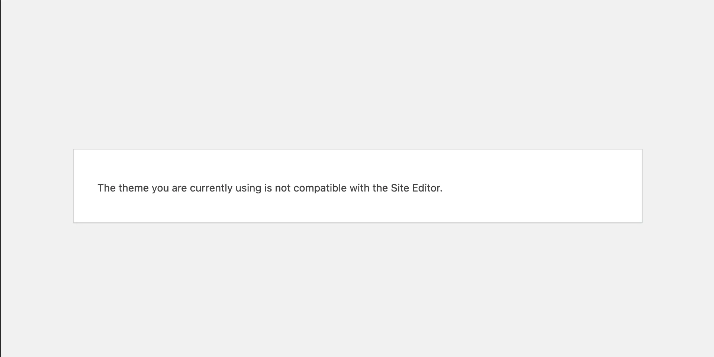

This title might be a bit misleading because, as of now, there’s no straightforward way to force the appearance panel without an index.html according to the WordPress source code. If you're building a hybrid theme or transitioning from `.php` to `.html` templates, you may have encountered this issue where you want to use the appearance editor but aren’t ready to fully adopt the `.html` template system.

You’re not alone. This has been an [open issue](https://github.com/WordPress/gutenberg/issues/39931) for over two years, and no solution has been officially accepted. This can be frustrating, as it presents a significant barrier to embracing the block editor. In some cases, using an `index.html` template overrides the PHP counterpart, which may not be ideal without careful planning or extensive work in converting to the HTML theme template system.

## Ways to Enable the Appearance Editor

You can enable the appearance editor by creating an `index.html` file in one of two locations:

1. `templates/index.html`
2. `block-templates/index.html`

That’s it. Based on the source code, there are no other ways to achieve this.

- [is_block_theme()](https://github.com/WordPress/WordPress/blob/master/wp-includes/class-wp-theme.php#L1577-L1597) - Specifically checks for `index.html`.
- [site-editor.php](https://github.com/WordPress/WordPress/blob/49ed36d7173058f25fb429a53d357902d8da9e91/wp-admin/site-editor.php#L29-L35) - Uses `is_block_theme()` to prevent access to `site-editor.php` if the criteria is not met.

## How to Move Forward

There are a few ways to move forward, but each comes with trade-offs 😅. Sorry, but that’s just how it is.

### Option 1: Converting Your Site to Blocks

Unfortunately, this is the best long-term solution. It requires the most work, but if you convert your site to the new HTML system, you can fully utilize the appearance editor. However, it’s a significant time investment for custom sites, as you may need to recreate many templates as blocks to make this viable.

**Pros:**
- Full access to the appearance editor.

**Cons:**
- High time and resource investment.

### Option 2: Rendering a Template with a PHP Server-Side Block

You can try using `index.html` along with a custom server-side block to render what your original template would have displayed. In my case, this approach caused some issues with scripts rendering incorrectly, but it’s worth trying since it’s relatively simple and doesn’t require a large time commitment.

**Steps:**

1. Create a barebones block for use in a pattern or template.
2. Use a PHP render in the `save` method to output the PHP code you'd normally render.
3. Use the block within an `.html` template.

**WARNING:**
This option had some side effects for me. Although the template rendered correctly on the frontend, some header scripts behaved unexpectedly.

**Pros:**
- Full access to the appearance editor.
- Low time investment.
- Allows the use of `index.html`.

**Cons:**
- May cause unintended side effects.
- Feels like a workaround rather than a true solution 😅.

### Option 3: Avoid Using `index.html` Altogether

Through trial and error, I considered not using `index.html` at all. However, I still wanted to use patterns and templates within the block editor. Initially, I struggled to find a way to manage patterns without the appearance editor, as there was little documentation on this. Here’s what I learned:

#### Managing Patterns Without `index.html`

Since we can’t edit patterns via the appearance editor, we must do things a little differently. WordPress offers a custom post type for patterns under `wp_block`. This lists all patterns saved on your site. Here’s how to access it:

- Go to `/wp-admin/edit.php?post_type=wp_block` while logged in.
- Alternatively, access the "Manage Patterns" link within the block editor:
  - Options > Tools > Manage Patterns.
  - On a synced block, Options > Manage Patterns (not available on non-synced blocks).

**Pros:**
- You can add, edit, and delete patterns.
- No need for `index.html`, so your PHP templates work as expected.
- Theme-registered patterns are still accessible 😄.
- You can delay converting to `.html` templates.

**Cons:**
- Custom patterns registered in `/patterns/your-pattern.php` won’t automatically appear in the appearance editor.
- Accessing and managing patterns is not intuitive and hard to find for most users.

## Accessing the `wp_block` Post Type

1. Go to `/wp-admin/edit.php?post_type=wp_block` while logged in.
2. Create custom patterns via the block editor. (Note: The "Manage Patterns" button only appears if you create a synced block.)
3. You can view all patterns on the block editor page, though there’s no "Manage Patterns" link here.
4. Under the options menu, find the "Manage Patterns" button in the tools section.

## Summary

I hope this information saves others some time. I found limited resources while troubleshooting my specific use case, and maybe I wasn’t searching for the right answers, or perhaps it’s just not widely known. Either way, I spent more time troubleshooting the platform than actually solving problems.
