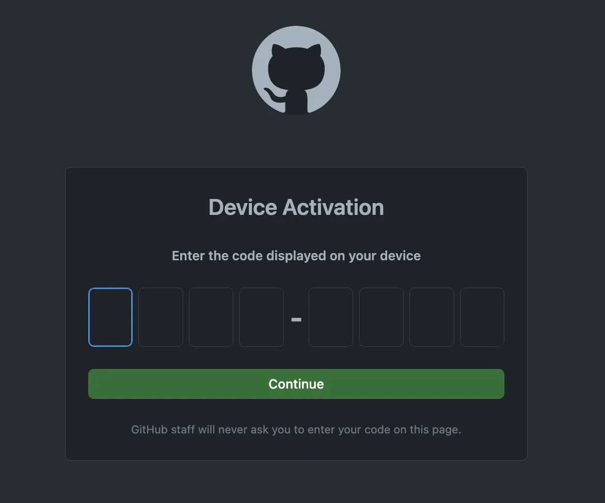

Before proceeding, you should start with installation based on your device. Checkout the [official instructions](https://github.com/cli/cli#installation) to get started.

Once the GH CLI is installed you should have a new directory that will contain your config file. For mac users this will be located `~/.config/gh/config.yml` by default. However, this may vary according to how you installed the `gh` or if you're on Windows.

The config file stores all the details about your setup as well as custom aliases. You can also transfer this file to other computers if you use the GitHub CLI on multiple machines.

## GitHub Authentication
Before you can use the GitHub CLI, you'll need to authenticate your GitHub account. Attempting to use a command like `gh pr view 123` without authentication will result in an error message like this:

```shell
To get started with GitHub CLI, please run:  gh auth login
Alternatively, populate the GH_TOKEN environment variable with a GitHub API authentication token.
```

To begin, run the command from the error message, `gh auth login`. You'll then need to choose between `GitHub.com` or `GitHub Enterprise Server`. Unless you use GitHub Enterprise Server for your GitHub account, select the `GitHub.com` option.

```shell
❯ gh-cli-course (master) ✔ gh auth login
? What account do you want to log into?  [Use arrows to move, type to filter]
> GitHub.com
  GitHub Enterprise Server
```

After selecting `GitHub.com`, you'll be prompted to choose how you want to clone repositories. I recommend using `SSH` since it’s slightly more secure, but both options are available. You can skip to the section relevant to your choice.

## SSH Auth Login
To get started with SSH, just use the arrow keys and hit the enter key to move forward in the CLI interface.

```shell
? What account do you want to log into? GitHub.com
? What is your preferred protocol for Git operations?  [Use arrows to move, type to filter]
  HTTPS
> SSH
```

### Generating an SSH key
If you haven't yet set up an SSH key for your GitHub account, you'll be prompted to do so. If you already have a public SSH key, you can proceed to the next step.

To create a new SSH key, type `Y` and press Enter.

```shell
? Generate a new SSH key to add to your GitHub account? (Y/n)
```

Next, you'll be asked whether you want to set a passphrase for your new SSH key. Press Enter to skip or enter your passphrase and then press Enter.

```shell
Enter a passphrase for your new SSH key (Optional)
```

Then, you'll be prompted to name your new SSH key. Pressing Enter will use the default name "GitHub CLI".

```shell
Title for your SSH key: GitHub CLI
```

Now, you're ready to authenticate the CLI. I recommend using the browser method as it guides you through the process. Alternatively, you can manually create or find an existing token by visiting https://github.com/settings/tokens.

Select the "Browser" option, and you'll be given a one-time code to use in your browser after you press Enter.

```shell
? How would you like to authenticate GitHub CLI? Login with a web browser
```


After hitting "Authorize," your terminal should update, confirming the successful authentication:

```shell
✓ Authentication complete.
- gh config set -h github.com git_protocol ssh
✓ Configured git protocol
✓ Uploaded the SSH key to your GitHub account: /Users/mikeengland/.ssh/id_ed25519.pub
✓ Logged in as michealengland
```

### Using an Existing SSH Key
If an SSH key is detected on your machine, you'll be prompted to upload it to your GitHub account.

```shell
Upload your SSH public key to your GitHub account?  [Use arrows to move, type to filter]
> /Users/ExampleUser/.ssh/id.pub
```

## HTTPS Auth Login
```shell
? What account do you want to log into? GitHub.com
? What is your preferred protocol for Git operations?  [Use arrows to move, type to filter]
> HTTPS
  SSH
```

When you select the HTTPS option, the CLI will prompt you with a choice about your preferred authentication method. Selecting `Y` or typing `Yes` will automatically choose the `Paste an authentication token` option at the next prompt. Conversely, using `N` or `No` will default to the `Login with a web browser` option.

For the purposes of this guide, we'll authenticate using the browser. If you already possess an authentication token, you can use that method as well; the steps are quite similar.

## Authenticating with the Browser
Select the "Login with a web browser" option and hit enter.

```shell
? How would you like to authenticate GitHub CLI?  [Use arrows to move, type to filter]
> Login with a web browser
  Paste an authentication token
```

After selecting the "Login with a web browser" option, a one-time code will display, which you'll use in the browser once you press Enter.

```shell
? How would you like to authenticate GitHub CLI? Login with a web browser
```



Once you've entered the code from the terminal and clicked "Continue," an authorization page will appear.


Click "Authorize" to complete the authentication process.

## Verifying you're properly logged in
After you've been properly authorized in the GitHub CLI, you can confirm your login status with the `gh auth status` command. It will display the account you're logged into and the type of authorization you have. In this example, the authorization was done using the SSH protocol.

```shell
❯ gh-cli-course (master) ✔ gh auth status
github.com
  ✓ Logged in to github.com as michealengland (oauth_token)
  ✓ Git operations for github.com configured to use ssh protocol.
  ✓ Token: *******************
```

_ℹ️  If you encounter authorization issues and need to restart the process, you can delete or rename your current `.ssh` config directory and begin again at any time. The location of this directory may vary depending on your machine._

## Takeaways
Now that we have the GH CLI authorized you're ready to begin using it. In the next blog to be released in this series, we'll discuss [initializing a repo](/blog/ghcli-2-initializing-a-repo-with-the-github-cli/).