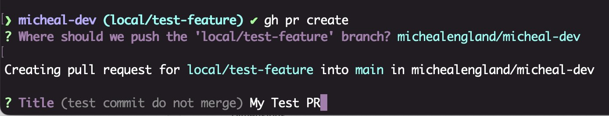
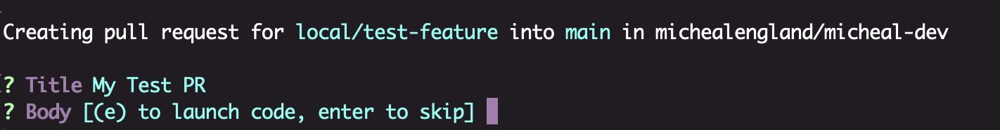
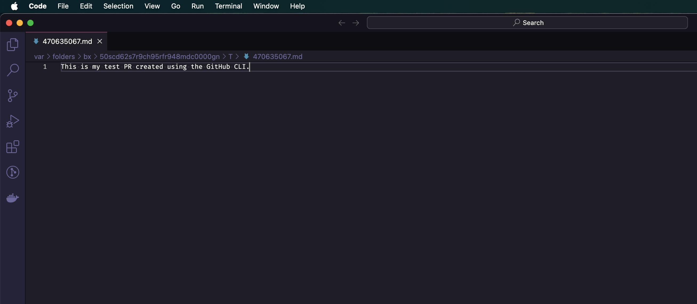
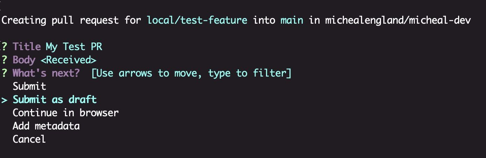
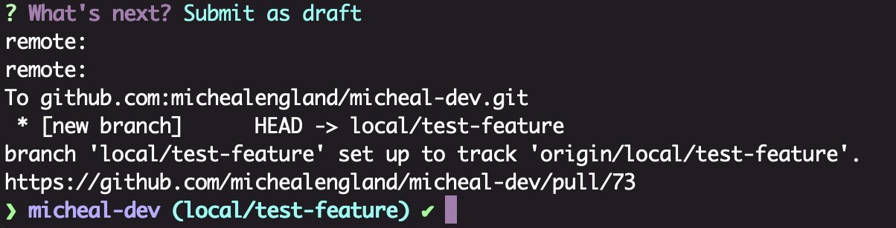
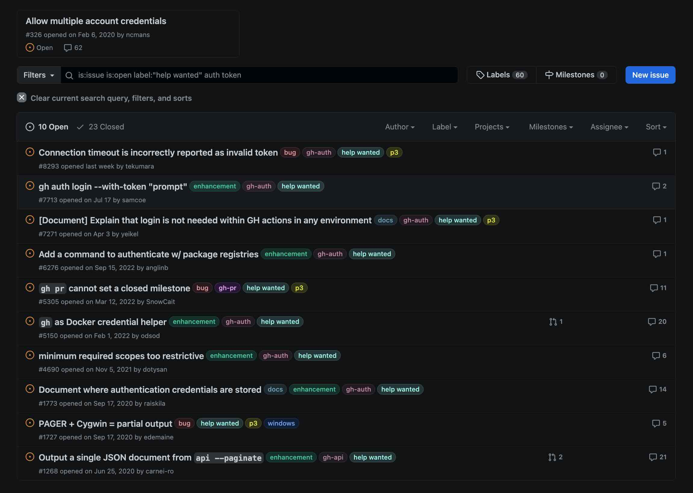
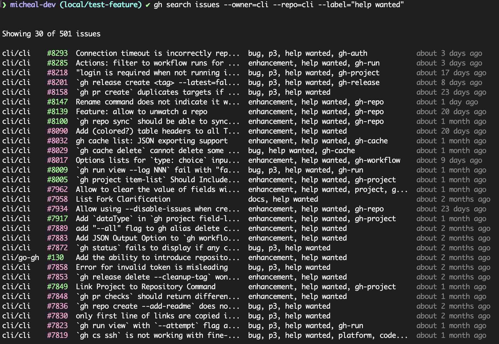
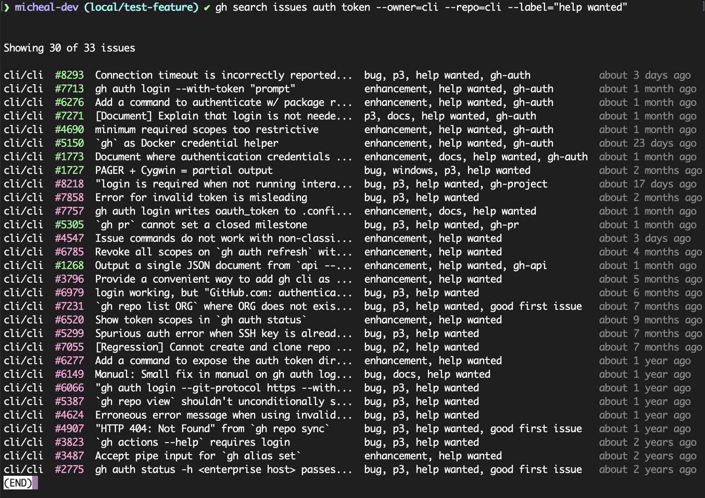

When I first started learning the GitHub CLI, I found that creating some commands was straightforward, while others required a bit of trial and error. Let's walk through a few examples.

## Creating a New PR

**Scenario:** You've made code changes and committed them on a feature branch. Now, you're ready to create a new PR.

A good first step is to identify the [top-level command](https://cli.github.com/manual/gh_pr) that aligns with your task. In this case, `gh pr` seems promising for working with pull requests. Delving deeper, we find the `create` subcommand, offering ample configurability.
### Try:
Start with `gh pr create`. You'll encounter an interactive shell UI that asks a few questions:

First, select the repository. Simply hit Enter on your desired option.

Next, you'll be prompted to provide a title for your PR.

After entering the title, you're given the option to write a description. Pressing the "e" key opens your editor to write the PR description. Alternatively, hitting Enter skips this step and moves directly to pushing the PR.

As shown below, I have my editor set up to open a new document in VS Code. Editing, saving, and closing this document will save your draft. Don't worry if yours uses doesn't look like mine, I'll cover more of this later on.

After closing the temporary document, the terminal will display the "What's Next" section. Here, you can finalize your PR, such as submitting it as a draft.

You'll then see a confirmation with details about your newly created draft PR.

We can further interact with the PR using the `gh pr view` command, adding the PR number.

- View PR in the terminal: `gh pr view 73`
- View PR in the default web browser (using the `-w` flag): `gh pr view 73 -w`

> [!note] Try experimenting with additional flags
> As shown in the Aliases chapter, we can further refine the command by taking advantage of the flags shown within the documentation, for example `pr create --draft --assignee @me`.

## Searching an External Repo with the GitHub CLI
Next, let’s explore a more advanced command that involves using variables and searching GitHub for a specific repo with additional filters.

**Scenario:** We'll search the GitHub CLI repo for open issues containing the phrase "auth token" and tagged with the "help wanted" label.

When uncertain about how to execute a specific task in the GitHub CLI, the website can be a useful resource for visualizing ideas.

Below is an image showing the [filtered search](https://github.com/cli/cli/issues?q=is%3Aissue+is%3Aopen+auth+token) based on our scenario.

### Try:
Let's break down the process to put together an initial command.

1. To retrieve all issues in `cli/cli`, we need to narrow down the owner and repository. _Note: You can find the owner and repository identifiers in the GitHub URL, like `github.com/owner/repo`._
2. According to the [documentation on searching issues](https://cli.github.com/manual/gh_search_issues), we can use `--owner=cli` and `--repo=cli` flags to specify our search.
3. Our initial command is `gh search --owner=cli --repo=cli`.

Now, let’s refine the search with additional flags from the documentation.

First, we’ll add the "help wanted" label using `--label`. Since the label consists of two words, we enclose it in quotes: `--label="help wanted"`. The command `gh search issues --owner=cli --repo=cli --label="help wanted"` gives us a more focused list of issues.

Lastly, let's refine this one more time by adding our phrase into the search. According to the documentation, our structure should look like this `gh search issues [<query>] [flags]`. So let's try it out `gh search issues auth token --owner=cli --repo=cli --label="help wanted"`

Finally, let's refine the search further by including the phrase "auth token". Based on the [documentation](https://cli.github.com/manual/gh_search_issues), our command format is `gh search issues [<query>] [flags]`. Let’s try `gh search issues auth token --owner=cli --repo=cli --label="help wanted"`.

In this guide, we explored practical applications of the GitHub CLI, focusing on creating a new Pull Request (PR) and searching within an external repository. Now, we're ready to examine how we can store commands for reuse using aliases.