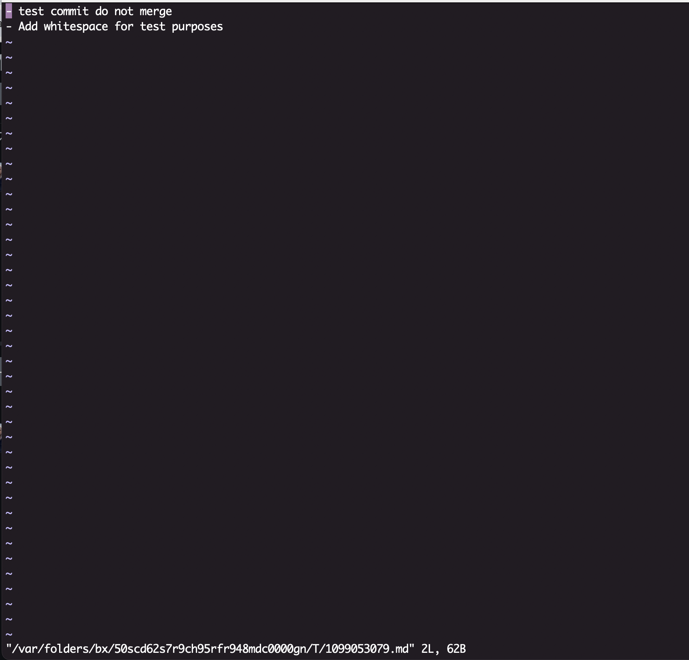
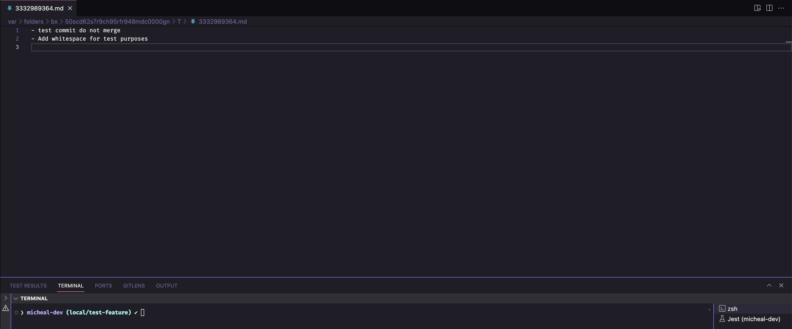
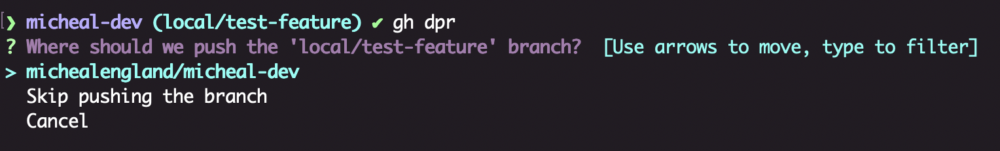
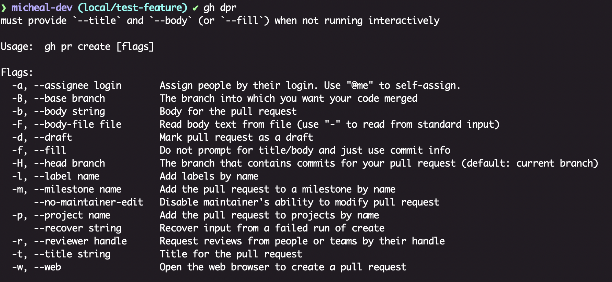
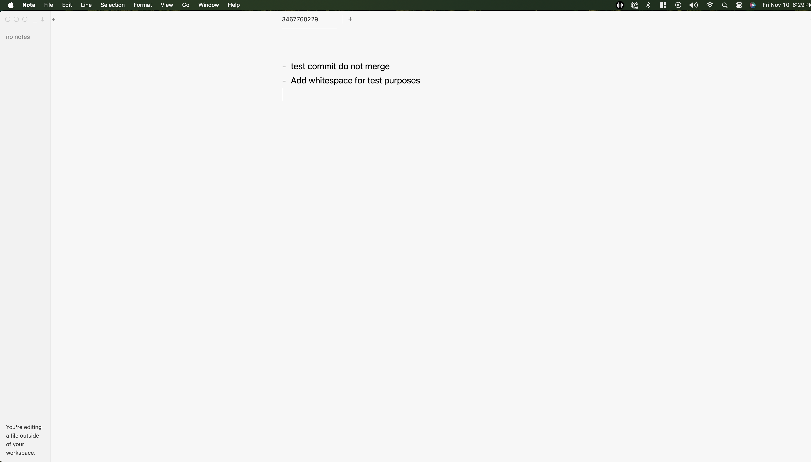

In the GitHub CLI, there's a special rule that allows you to choose how documents are edited. For example, users wanting to write a pull request on their machine can specify `code --wait` to write PRs directly in their default code editor.

This lesson will explore this feature. It should be noted that while this feature works with some external apps, results may vary.

Below are some examples from the [GitHub CLI manual](https://cli.github.com/manual/gh_config_set):
## Vim
Write your PR directly in the shell with Vim.
```shell
gh config set editor vim
```



## Code Wait
This option opens a temporary document in your default code editor. Changes must be saved, and once the document is closed, you can proceed with uploading the PR to GitHub.

I prefer this option as it allows me to use markdown plugins within VS Code.

_Note: The `--wait` flag tells the UI to wait for the editor before proceeding._

```shell
gh config set editor "code --wait"
```



## SSH
Change your protocol to SSH or HTTPS.

```shell
gh config set git_protocol ssh --host github.com
```

## Enabling / Disabling the Prompt
Enable:
```shell
gh config set prompt enabled
```

By default, this option is enabled when the GitHub CLI is installed, allowing users to utilize interactive prompts.



Disable:
```shell
gh config set prompt disabled
```

Disabling the prompt requires additional flags for commands that the interactive UI would normally set up.



## Custom Configuration
It’s worth mentioning that you can configure your default editor to work with other applications on your machine. However, compatibility and functionality might vary. Here's how I configured my editor to use Nota MD:

First, I installed the [Nota CLI](https://docs.nota.md/command-line-interface) to make it executable from the command line. Then, I verified that using `nota` in the command line successfully opened the application.

Once the Nota CLI was functional, I used the following command:

```shell
gh config set editor "nota --wait"
```

You can test this by drafting a PR from the command line.

```shell
gh pr create --draft --assignee @me
```

One downside I've encountered with this setup is the need to fully close the Nota application after using it. This requirement can be a bit frustrating, especially since I frequently use Nota for note-taking purposes. While other applications might integrate more seamlessly with the GitHub CLI.


